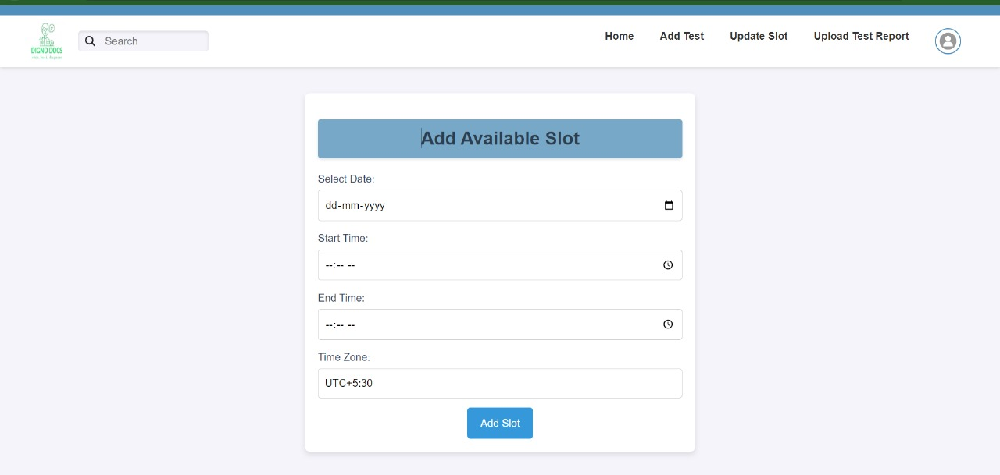
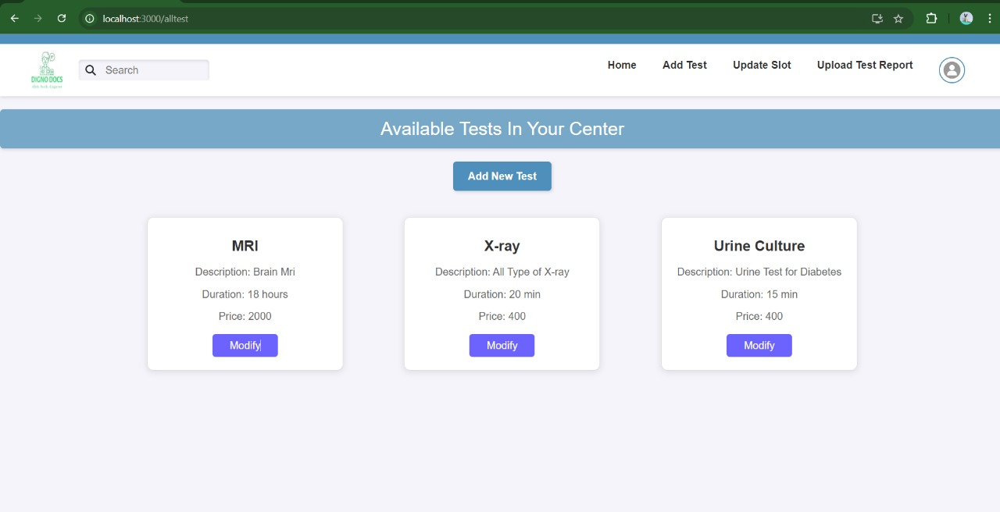
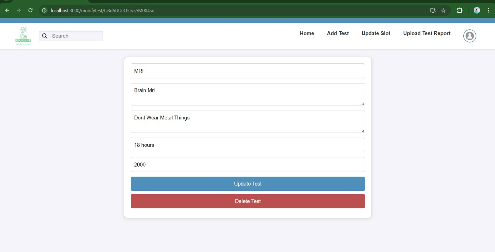
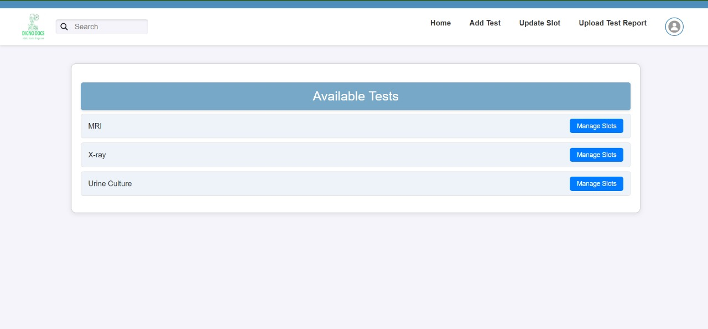
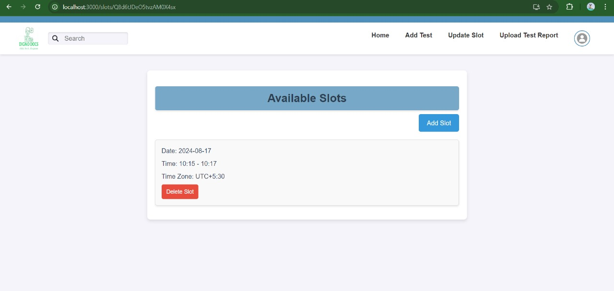

Smart Diagnostic Center Hub

## Description
Smart Diagnostic Center Hub is a full-stack web application that allows diagnostic centers to register their available tests, pricing, and facilities. Patients can easily find and book appointments at nearby centers using filters such as price and service availability. Built with React, Node.js, Express, and Firebase, this application provides real-time data synchronization, ensuring users always have access to the latest information.


## Screenshots
Here is a screenshot of the application:








## Installation
To install this project, run the following command:

```bash
npm install
